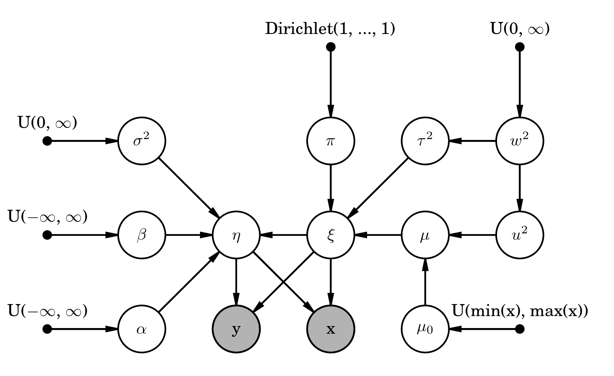

# linmix_py
A Bayesian approach to linear regression with errors in both X and Y.  Python port of B. Kelly's
LINMIX_ERR IDL package (Kelly2007, arXiv:0705.2774).  Paraphrasing from the LINMIX_ERR.pro IDL
routine:

Perform linear regression of y on x when there are measurement errors in both variables.  The
regression assumes:

eta = alpha + beta * xi + epsilon

x = xi + xerr

y = eta + yerr

Here, (_alpha_, _beta_) are the regression coefficients, _epsilon_ is the intrinsic random scatter
about the regression, _xerr_ is the measurement error in _x_, and _yerr_ is the measurement error
in _y_.  _epsilon_ is assumed to be normally-distributed with mean zero and variance _sigsqr_.
_xerr_ and _yerr_ are assumed to be normally-distributed with means equal to zero, variances
_xsig_^2 and _ysig_^2, respectively, and covariance _xycov_.  The distribution of _xi_ is modeled as
a mixture of normals, with group proportions _pi_, means _mu_, and variances _tausqr_.  The following
graphical model illustrates, well..., the model...



Bayesian inference is employed, and a Markov chain containing random draws from the posterior is
developed. Convergence of the MCMC to the posterior is monitored using the potential scale reduction
factor (RHAT, Gelman et al. 2004). In general, when RHAT < 1.1 then approximate convergence is
reached.

Documentation
-------------

More detailed documentation can be found at http://linmix.readthedocs.org/en/latest/.  In particular,
the API is listed at http://linmix.readthedocs.org/en/latest/src/linmix.html, and a worked example
(the same as in Kelly (2007) (arXiv:0705.2774)), is at http://linmix.readthedocs.org/en/latest/example.html.

Usage
-----
```
import linmix
lm = linmix.LinMix(x, y, xsig=xsig, ysig=ysig, xycov=xycov, delta=delta, K=K, nchains=nchains)
lm.run_mcmc(miniter=miniter, maxiter=maxiter, silent=silent)
print lm.chains['alpha'].mean(), lm.chains['alpha'].std()
print lm.chains['beta'].mean(), lm.chains['beta'].std()
print lm.chains['sigsqr'].mean(), lm.chains['sigsqr'].std()
```

Installation
------------
Currently, the best way to get linmix for python is to clone from github and build using normal
setup.py facilities.  (see http://linmix.readthedocs.org/en/latest/install.html)  In the future, I
hope to add linmix to PyPI.
